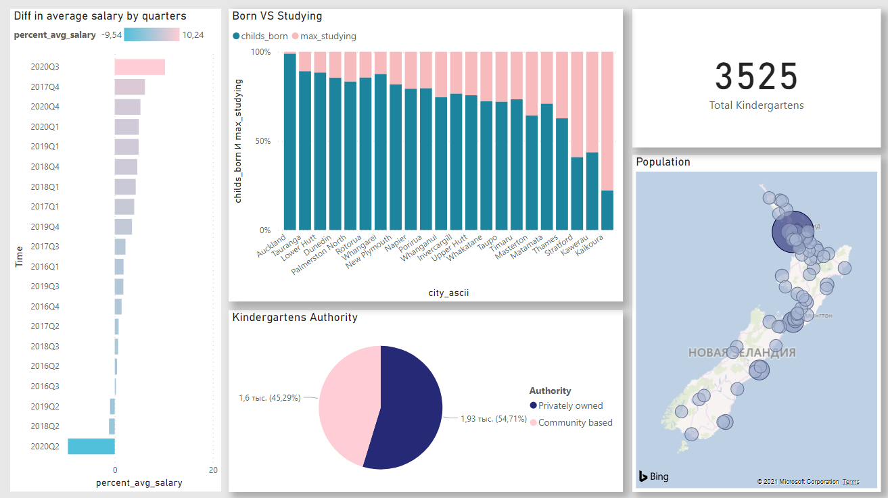

# PRE-SCHOOL EDUCATION ANALYSIS NEW ZEALAND

### Prepared by Lidziya Vitushka

#### The Purpose

The main purpose of the project was to identify the most promising places for opening a private preschool education institution.

#### Goals of this project

* to explore the correspondence of the number of kindergartens to the number of children living there;

* to analyse the dynamics of the birth rate of children in cities;

* to estimate the standard of living of the local urban population based on the average quarterly salary;

* to evaluate the overall ratio of preschool education institutions to the resident population.

#### Initial Dataset

File name                 | Data provided by             | Dataset Name   | Web-page
--------------------------|------------------------------|----------------|---------
BIRTHS.CSV                | Stats NZ | Live births by area, city district councils (Maori and total population) (Qrtly-MarJunSepDec) | http://archive.stats.govt.nz/infoshare/ 
WORLDCITIES.CSV           | SimpleMaps.com | World Cities Database (Basic) | https://simplemaps.com/data/world-cities
EARNINGS.CSV              | Stats NZ | QEX - Average Weekly Earnings (Employees) by Regional Council and Sex (Qrtly-MarJunSepDec) | http://archive.stats.govt.nz/infoshare/
KINDERGARTENS.CSV         | Ministry of Education of New Zealand | Early Childhood Services (ECE) Directory | https://catalogue.data.govt.nz/dataset/directory-of-educational-institutions

#### Result

